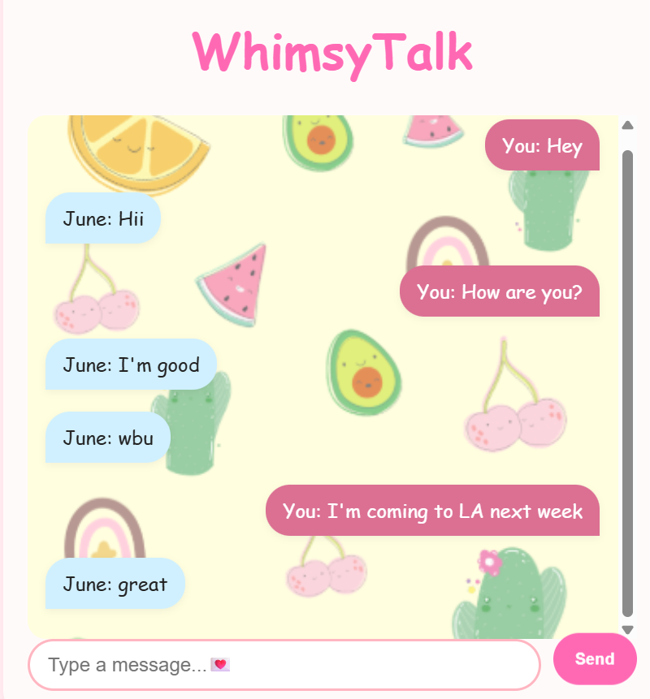

# WhimsyTalk
A simple real-time chat app with end-to-end encryption built using Flask, Socket.IO, and CryptoJS

✨ Features
1.Clean pastel-themed interface

2.End-to-end AES encryption (client-side)

3.Real-time chat with WebSockets

4.Personalized username prompt

5.“You vs Them” message layout

📁 Project Structure
```

WhimsyTalk/
│
├── app.py                # Flask backend + Socket.IO
├── templates/
│   └── index.html        # Main chat interface
├── static/
│   ├── style.css         # Styling
│   └── img/kawaii.png    # (Optional) background image
```




🚀 Getting Started
1. Install dependencies
```
pip install flask flask-socketio
```

```
pip install eventlet
```
2. Run the app
```
python app.py
```

🔐 Encryption
Messages are encrypted using AES (CryptoJS) before sending.

The shared key is hardcoded (supersecretkey123) in the client.

The server only relays encrypted data — no decryption happens server-side.
